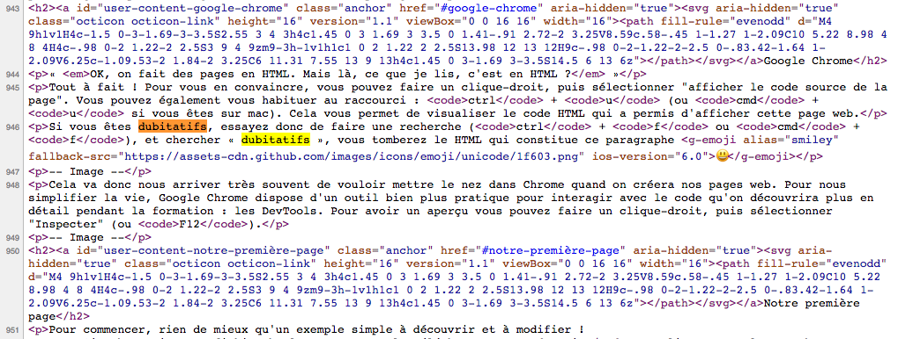
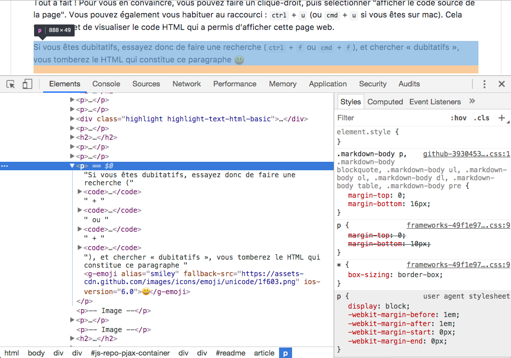
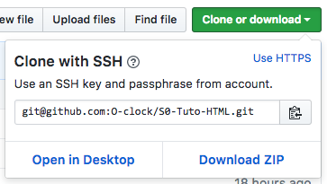
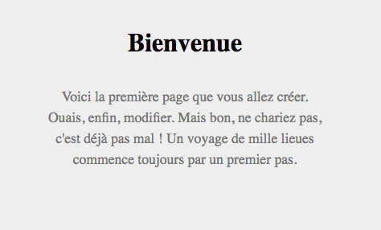
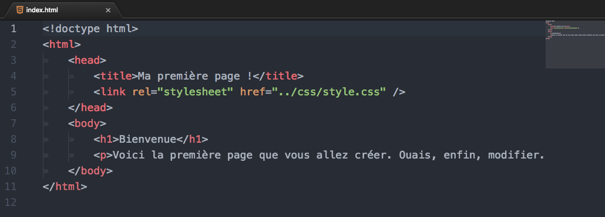
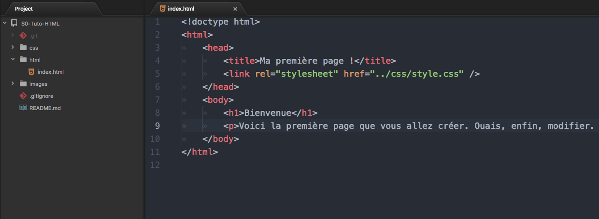
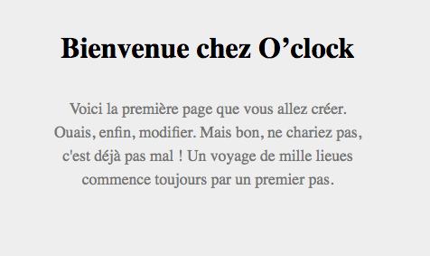
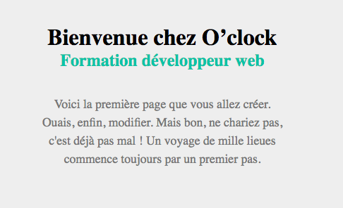

# Codons notre première ligne en HTML !

## C'est quoi le HTML ?
Le HTML, c'est le langage utilisé pour décrire le contenu d'une page web. Concrètement, créer un fichier HTML, cela signifie créer un fichier au format texte dans lequel on va utiliser une grammaire bien précise pour décrire de l'information. On va pouvoir préciser le contenu de l'information mais également le type d'information, qu'on appelle « sémantique ».

Par exemple, si on veut un **titre de niveau I**, dont le contenu texte est "Bienvenue".
Voilà à quoi ressemble du code html :
```html
<h1>Bienvenue</h1>
```

Dans la grammaire HTML, la balise `<h1>` signifie **titre de niveau I**. Si on ouvre cette page web dans un navigateur web tel que Google Chrome, le navigateur affichera ce texte. **Sans plus de précision de notre part**, le navigateur utilise la sémantique pour choisir comment afficher le texte. Dans notre cas, puisqu'il s'agit d'un titre, on peut imaginer que le navigateur va l'afficher en plus gros.


## Google Chrome
« *OK, on fait des pages en HTML. Mais là, ce que je lis, c'est en HTML ?* »

Tout à fait, la page que vous lisez actuellement, c'est du HTML ! Pour vous en convaincre, vous pouvez faire un clique-droit, puis sélectionner "afficher le code source de la page". Vous pouvez également vous habituer au raccourci : `ctrl` + `u` (ou `cmd` + `u` si vous êtes sur mac). Cela vous permet de visualiser le code HTML qui a permis d'afficher cette page web.

Si vous êtes dubitatifs, essayez donc de faire une recherche (`ctrl` + `f` ou `cmd` + `f`), et chercher « dubitatifs », vous tomberez le HTML qui constitue ce paragraphe :smiley:

<kbd></kbd>

Cela va donc nous arriver très souvent de vouloir mettre le nez dans Chrome quand on créera nos pages web. Pour nous simplifier la vie, Google Chrome dispose d'un outil bien plus pratique pour interagir avec le code qu'on découvrira plus en détail pendant la formation : les DevTools. Pour avoir un aperçu vous pouvez faire un clique-droit, puis sélectionner "Inspecter" (ou `F12`).

<kbd></kbd>


## Notre première page
Pour commencer, rien de mieux qu'un exemple simple à découvrir et à modifier !
Ce repo GitHub contient un fichier html. Vous pouvez télécharger un `.zip` en cliquant sur le gros bouton vert en haut à droite "Clone or download". Ça ressemble à ça :

<kbd></kbd>

[Dézippez-le](https://www.google.fr/search?q=dézipper), et ouvrez le fichier `html/index.html` à l'aide d'un double-clic. Le fichier va s'ouvrir dans Google Chrome.

<kbd></kbd>

Allons modifier le code HTML !


## Atom
Rappelons-nous : nos pages web sont codées via des fichiers textes. Un fichier dans lequel on a défini un contenu avec de la grammaire HTML. Pour aller modifier un fichier texte, il nous faut un **éditeur de texte**, c'est-à-dire, un logiciel capable d'ouvrir un fichier et nous permettre d'en modifier le contenu.

Pour cela, nous allons utiliser **Atom**. Il s'agit d'un éditeur de texte créé tout particulièrement pour écrire du code.

« _Pourquoi Atom ?_ »
Des éditeurs de texte, il y en a plein. Atom est simplement l'un d'entre eux. C'est l'éditeur que nous recommandons pour la formation, mais c'est aussi l'éditeur que la Team O’clock utilise au quotidien pour développer. C'est un éditeur léger, simple à utiliser, cross-platform, open-source, extensible, customisable. Tous les ingrédients qui en font un choix de prédilection. Et puis, c'est l'équipe de GitHub qui est à la tête de ce projet. Pas des rigolos, donc.

Bref, revenons à notre page HTML.

On va l'ouvrir dans Atom, à l'aide d'un `clic-droit > ouvrir avec`. On peut aussi ouvrir Atom d'abord, puis ouvrir le fichier HTML avec `Fichier > Ouvrir` / `File > Open`.

<kbd></kbd>

On peut aussi ouvrir le dossier en entier. On fera souvent ça pendant la formation, pour nous permettre d'ouvrir facilement tous les fichiers de nos projets dans Atom. Pour cela, il faut choisir `File > Open folder…` (les libellés peuvent changer selon la version d'Atom et votre système d'exploitation).

<kbd></kbd>

Pratique, Atom reconnait qu'il s'agit de HTML, et va venir nous mettre automatiquement un peu de couleur dans tout ce bazar ! Nous reviendrons sur tout ça en détail la semaine prochaine. Mais on peut déjà remarquer quelques petites choses…

Il ne s'agit pas de tout comprendre du premier coup ; vous verrez, ça sera le cas de nombreuses fois dans la formation. Il est même fort probable que chaque jour, vous vous sentiez largué. C'est **tout à fait normal**. Le code, c'est souvent plein de concepts en même temps. On ne comprend jamais tout du premier coup ! Mais surtout, pas de panique, même quand vous vous croyez à l'Ouest, vous assimilez un tas d'infos sans vous en rendre compte. :relieved: 

Bref, nous disions. On peut remarquer qu'un fichier HTML :
* commence toujours par un `doctype`. Ça permet d'indiquer dans quelle version du langage HTML la page va être écrite.

* comprend une balise `<html>` qui va tout englober. C'est l'élément racine de toute page HTML. Cherchez pas, c'est comme ça !

* comprend une balise `<body>` qui est située à l'intérieur de la racine `<html>`. Cette balise contient les données principales : le corps de la page, c'est-à-dire, son contenu !

* comprend une balise `<head>` qui est également située à l'intérieur de la racine `<html>`, et que l'on vient placer juste avant le `<body>`. On mettra dedans les métadonnées, c'est-à-dire non pas le contenu, mais des données supplémentaires sur le document. Dans notre exemple, on vient donner un titre au document. Puisqu'il est dans le `<head>`, ce n'est pas un contenu, c'est juste de l'information. Il ne sera donc pas affiché dans la page web. En revanche, les informations du `<head>` sont utilisés par les navigateurs. Dans la plupart des navigateurs, le `<title>` est utilisé pour le texte qui sera affiché dans l'onglet du navigateur. On a également une balise `<link>` qui permet de faire un lien (logique !) vers un autre document : ici, une feuille de style (CSS)…

Arf, je vous disais qu'il y avait parfois beaucoup d'infos d'un coup…


## On modifie !
Allez, on va modifier cette page pour voir ce que ça donne ! :blush:

Modifiez la ligne 8 comme ci-dessous :
```html
<h1>Bienvenue chez O’clock</h1>
```

Enregistrer le fichier, avec `ctrl` + `s` (ou `cmd` + `s`). Vous pouvez aussi faire `Fichier > Enregistrer`, mais vu le nombre de fois où vous allez enregistrer des fichiers dans votre vie de développeur, je vous conseille de vous faire au raccourci clavier !

Retournons dans Google Chrome, et rechargeons la page. Là aussi, on peut se faire au raccourci : `F5` ou `ctrl` + `r` ou encore `cmd` + `r`.

Et bim !

<kbd></kbd>

Vous avez codé votre première ligne HTML ! :scream:

C'est aussi simple que ça le dev. Non, sans déconner, pendant 5 mois, on va écrire des trucs dans Atom, et ça va faire des trucs géniaux. Bon là, on a juste rajouté un texte. C'est normal, c'est le premier jour. Que dis-je, ce n'est même pas encore le premier jour ! Mais la semaine prochaine, on mettra déjà en ligne votre premier site ! Et imaginez-vous que dans 5 mois, vous présenterez fièrement un projet complet !

Revenons dans le présent. Nous avons modifié le `<h1>`, c'est le **titre de niveau I**. Comment ça, vous le saviez déjà ?!

Il existe également d'autres titres, jusqu'au niveau 6 : `<h2>`, `<h3>`, `<h4>`, `<h5>`, `<h6>`. En dessous, nous avons un `<p>`, une balise qui nous permet de décrire **un paragraphe de texte**.


## Encore ?
Allez, soyons fous. Rajoutons un **titre de niveau II** juste après notre `<h1>`, avec le contenu que vous voulez. Je vous laisse deviner ce qu'il faut écrire…

<kbd></kbd>

Magique !
Voici le code qu'il fallait écrire pour obtenir cet affichage :

```html
<!doctype html>
<html>
  <head>
    <title>Ma première page !</title>
    <link rel="stylesheet" href="../css/style.css" />
  </head>
  <body>
    <h1>Bienvenue chez O’clock</h1>
    <h2>Formation développeur web</h2>
    <p>Voici la première page que vous allez créer. Ouais, enfin, modifier. Mais bon, ne chariez pas, c'est déjà pas mal ! Un voyage de mille lieues commence toujours par un premier pas.</p>
  </body>
</html>
```

Vous avez sans doute remarquer que notre `<h2>` est coloré en vert. Pourtant, nous n'avons rien dit de particulier dans notre code HTML pour indiquer au navigateur de colorer ce titre en vert. D'ailleurs, nous n'avons pas non plus préciser que notre contenu devait être centré par exemple. C'est normal ?

C'est normal. Le HTML sert à décrire **le contenu** uniquement. Il n'est pas utilisé pour décrire **la présentation**. Pour cela, on utilisera un autre langage, le CSS, qui permettra de décrire uniquement la présentation, sans décrire le contenu. On appelle ça la séparation des concepts, ou **separation of concerns** en anglais : on utilise des fichiers différents (HTML ≠ CSS) pour des logiques différentes (contenu ≠ présentation).

**C'est très chouette comme idée**, car ça nous permet d'avoir des fichiers facilement utilisables et modifiables. On veut changer le contenu ? Il suffit de changer le HTML, on ne change rien au CSS. Aussi, on pourrait aussi avoir deux documents HTML différents pointant **vers le même fichier CSS** : on définit une fois le style, et on peut l'appliquer sur autant de page que l'on veut. Pratique !


## Pour aller plus loin
Si vous voulez approfondir :
* Allez donc voir le fichier `css/style.css`, qui contient le code permettant d'obtenir l'affichage que l'on voit dans Chrome.

* Allez jeter un oeil dans l'inspecteur d'éléments de Chrome, cliquez sur une balise, et vous apercevrez à droite du panneau HTML, un panneau affichant le CSS qui s'applique sur cette balise. On peut même désactiver une propriété CSS en direct dans Chrome !

* Enfin, pour en savoir plus sur tout ça, je ne saurais vous recommander autre chose que le valeureux **Mozilla Developer Network**, qui contient une documentation très détaillée et qui fait office de référence en la matière :
  * https://developer.mozilla.org/fr/docs/Web/HTML
  * https://developer.mozilla.org/fr/docs/Web/CSS


That's all, folks!
Team O’clock.
